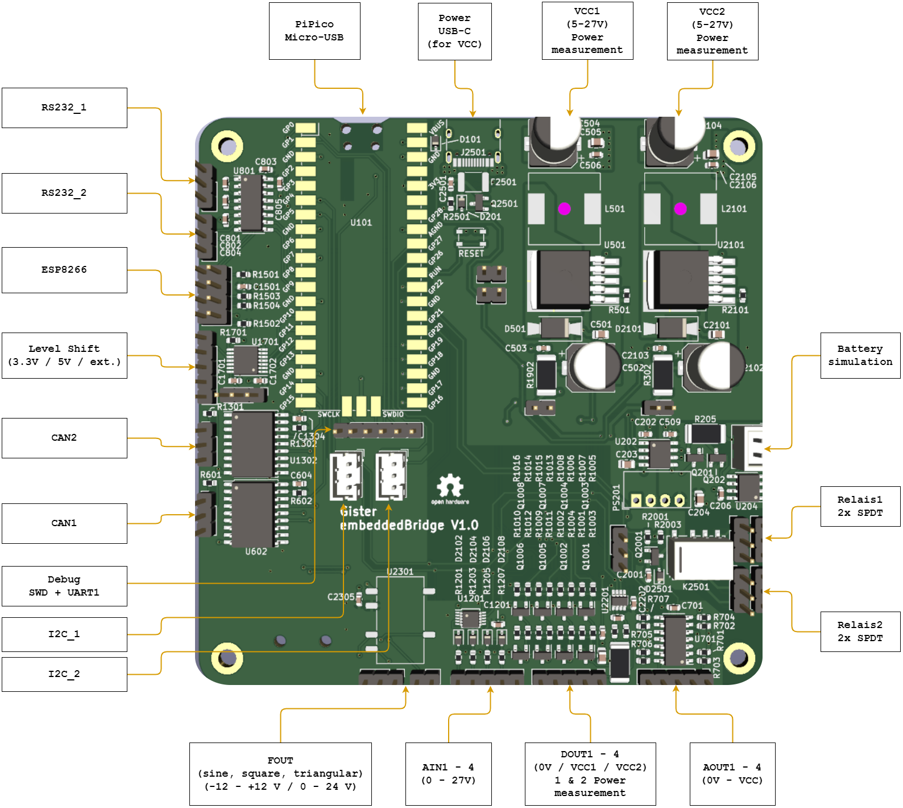

# embeddedBridge

Develop and test your own embedded system without the need to build a dedicated testbench. It is as easy as following three steps:
1. Connect your device under test to the corresponding GPIOs of the embeddedBridge (see: [Features](#Features))
2. Connect the embeddedBridge to your PC
3. Send commands automatically or manually via the serial connection to the embeddedBridge and thus your device

## Features 

- 4x DOUT (2x 0 - 24 V)
- 4x AOUT (0 - 24 V)
- 4x AIN (max. 27 V)
- 1x FOUT
- 2x Relais (2x SPDT)
- 4x Level shift
- 2x RS232
- 2x CAN
- 1x Battery sim
- ESP8266 interface
- SD card
- EEPROM

## Update

- Download the .uf2 from the newest [release](https://github.com/Asyny/embeddedBridge/releases) assets
- Connect the embeddedBridge via micro USB to your PC
- Press the RESET button and the BOOTSEL simultaneously
- Let go of the RESET and afterwards the BOOTSEL button
- Move the .uf2 into the newly connected USB Drive

## Automatic vs Manual mode

The embeddedBridge will start in the automatic mode where it expects SCPI like commands. If you want to switch to the manual mode where a menu is printed on the serial interface, then you can send the command "SYStem:COMmand:INput MENU". To switch back to the automatic mode, you simple need to exit the menu.
